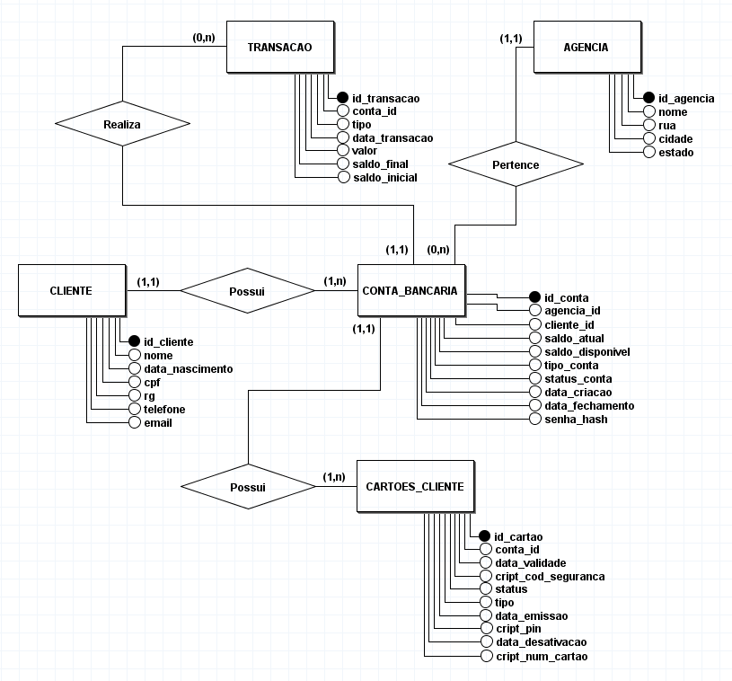
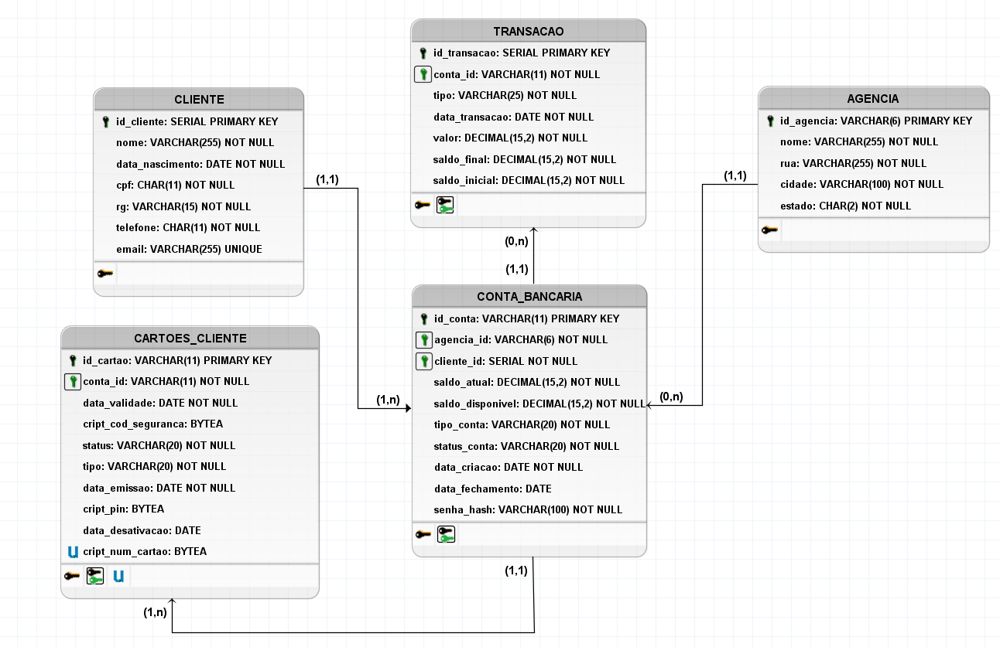

# Sistema de Transações Simples

## Descrição
O projeto VirtuBank - Simulador Simples de Transações Bancárias é uma aplicação desktop desenvolvida com o intuito de simular operações bancárias básicas, como depósitos, saques, transferências, além de consulta de saldos e extratos. Este sistema foi criado como parte do meu processo de aprendizado pessoal em desenvolvimento de software, servindo como uma oportunidade prática para aplicar e demonstrar as habilidades e conhecimentos que venho adquirindo na área.

Este projeto abrange práticas de desenvolvimento de software, tais como construção de APIs, modelagem e implantação de bancos de dados, implementação de medidas de segurança em aplicações desktop, etc. Este repositório serve como uma vitrine dos métodos, técnicas e tecnologias com as quais venho me familiarizando, demonstrando meu empenho em construir soluções de software robustas, escaláveis e seguras.

As funcionalidades do sistema incluem:
- Realização de saques;
- Efetuação de depósitos;
- Execução de transferências entre contas;
- Consulta de saldos e informações detalhadas da conta;
- Acesso a extratos das transações efetuadas.

## Início Rápido
Este guia fornece instruções rápidas para começar a usar o sistema.
### Pré-requisitos
Antes de iniciar, certifique-se de ter os seguintes softwares instalados em seu sistema:
- Python (versão 3.10 ou superior)
- Visual Studio Code (ou outra IDE de preferência)
- Postman
- Git
- PostgreSQL (versão 12 ou superior)
### Instalação para Desenvolvimento
Siga os passos abaixo para configurar o ambiente e iniciar o projeto:

1. **Clonar o repositório**\
Use o Git para clonar o repositório do projeto para o seu ambiente local. Abra um terminal e digite o seguinte comando:\
https://github.com/marioshenrique/simple_banking_transaction_system.git

2. **Configurar o ambiente virtual**\
Navegue até a pasta do projeto clonado e crie um ambiente virtual Python para isolar as dependências do projeto. Execute dentro do terminal:\
'python -m venv venv\'
3. **Ativar o ambiente virtual com o comando**\
Ative o ambiente virtual com o seguinte comando:\
'.venv\Scripts\activate'

5. **Instalar dependências**\
Instale todas as dependências necessárias para o projeto usando o arquivo 'requirements.txt' fornecido dentro da pasta do projeto. Com o ambiente virtual ativado, execute o seguinte comando:\
'pip install -r requirements.txt'

4. **Configurar variáveis de ambiente**\
Copie o arquivo '.env.example' contido no diretório 'api' para um novo arquivo chamado '.env' e preencha-o com suas configurações locais.

5. **Reconstruir o banco de dados do PostgreSQL na máquina local**\
PENDENTE

6. **Executar o projeto**\
Após a instalação das dependências e configurações das variáveis de ambiente, o sistema está pronto para ser executado em um servidor local. Para isso, execute o seguinte comando no terminal:\
'uvicorn api.api_controller:app --reload'

### Instalação para Testes do Sistema
Siga os passos para abrir o sistema desenvolvido neste projeto:

1. Inicialize a aplicação a partir do executável 'VirtuBank.exe'
2. Insira as informações de 'número da agência', 'número da conta corrente' e 'senha', fornecidos na seção a seguir, para acessar o sistema.

Se preferir, poderá reconstruir o executável. Para isso, insira o seguinte comando no terminal:

'pyinstaller --noconfirm --onefile --windowed --icon "app/VirtuBanck_icone-removebg-preview.ico" --debug "all" --hidden-import=babel.numbers  --add-data "app/tela_login_usuario;tela_login_usuario/" --add-data "app/tela_operacoes;tela_operacoes/" --add-data "app/api_client.py;." --add-data "app/login_interface.py;." --add-data "app/operations_interface.py;." --add-data "app/start.py;." --add-data "app/VirtuBanck_icone-removebg-preview.ico;."  "app/start.py"'

Após a execução deste comando, duas novas pastas serão criadas: 'build' e 'dist'. O executável poderá ser encontrado na pasta 'dist'.

As informações necessárias para testar a aplicação são fornecidas na seção 'Uso'.

## Uso
- Instruções detalhadas sobre como usar o sistema, incluindo exemplos de operações bancárias como saque, depósito, transferência, etc.
- Adicionar capturas de tela ou gifs demonstrando a utilização.

## Tecnologias Utilizadas
Abaixo destaco as principais ferramentos que foram utilizadas para o desenvolvimento deste projeto.

- **[FastAPI](https://fastapi.tiangolo.com/)**: Framework web para construção de APIs, escolhido devido à sua alta performance.
  
- **[SQLAlchemy](https://www.sqlalchemy.org/)**: Biblioteca SQL toolkit e Object-Relational Mapping (ORM) que permite trabalhar com bancos de dados de forma segura, auxiliando na construção de um código mais limpo e organizado.

- **[JWT (JSON Web Tokens)](https://jwt.io/)**: Foi implementada a autenticação e autorização no sistema por meio de JWT. Permitindo a criação de tokens de acesso e atualização para segurança do sistema e gerenciamento de sessões de usuários.

- **[PyJWT](https://pypi.org/project/PyJWT/)**: Biblioteca pra codificar e decodificar tokens JWT. Essencial para autenticação e autorização no projeto.

- **[Uvicorn](https://www.uvicorn.org/)**: Servidor ASGI utilizado para execução da aplicação FastAPI.

- **[Pydantic](https://docs.pydantic.dev/latest/)**: Utilizado para validação de dados. O Pydantic foi empregado na construção da API para definição de esquemas de dados.

- **[python-dotenv](https://pypi.org/project/python-dotenv/)**: Responsável por carregar as variáveis de ambiente a partir do arquivo '.env'.

- **[tkinter](https://docs.python.org/pt-br/3/library/tkinter.html)**: Biblioteca utilizada na criação das interfaces de usuário (UI).

- **[PostgreSQL](https://www.postgresql.org/)**: Gerenciador de bancos de dados relacionais (SGBD).

- **[EC2 AWS (Amazon Elastic Compute Cloud)](https://aws.amazon.com/pt/ec2/)**: Serviço de computação em nuvem da Amazon Web Services que permite a computação em nuvem. Foi utilizado neste projeto para hospedar a aplicação.

- **[RDS AWS (Amazon Relational Database Service)](https://aws.amazon.com/pt/rds/)**: Serviço de banco de dados relacional gerenciado da Amazon Web Services. O RDS foi utilizado para hospedar o banco de dados PostgreSQL na nuvem.

## Estrutura do Projeto
### API Controller
- Descrição: explicar a função da API dentro do sistema, como ela é utilizada para manipular transações bancárias e autenticação de usuários.
- Endpoints Principais: Listar os principais endpoints disponíveis na API e uma breve descrição de sua funcionalidade.
- Tecnologias Utilizadas: Detalhar as tecnologias usadas na construção da API (FastAPI, SQLAlchemy, etc).

### Serviço de Autenticação (auth_service)
- Descrição: Descrever como o serviço de autenticação funciona para proteger as rotas da API e validar os usuários.
- Mecanismo de autenticação: Explicar o mecanismo de autenticação usado (tokem JWT).
- Dependências: Listar as bibliotecas e frameworks utilizados para autenticação.

### Serviço de Conta (account_service)
- Descrição: Descrever como o serviço de conta funciona.

### Serviço de Transações (transaction_service)
- Descrição: Descrever como o serviço de transações funciona.

### Camada de Dados (Data Layer)
- Descrição: Oferecer uma visão geral da camada de dados, explicando como ela interage com o banco de dados para realizar operações CRUD.
- Modelos de Dados: Descrever os modelos de dados usados.
- Repositórios: Explicar a função dos repositórios na abstração das operações do banco de dados.

### Interface do Usuário (UI)
- Descrição: Apresentar informações sobre a interface do usuário, como ela permite interações com o sistema de transações.
- Tecnologias Utilizadas: Detalhar as tecnologias e ferramentas usadas para desenvolver a UI (frameworks e bibliotecas de UI).

### Modelagem do Banco de Dados
#### Esquema do Banco de Dados
O banco de dados utilizado no projeto foi projetado para suportar operações de transações, gerenciamento de contas de usuário e autenticação no sistema. A modelagem foi feita utilizando boas práticas de design de banco de dados relacional para segurar a integridade, segurança e escalabilidade dos dados do sistema.
##### Modelo Conceitual
O modelo conceitual abaixo fornece uma visão da estrutura do banco de dados, destacando as entidades, seus atributos e as relações entre elas. A partir deste modelo ém possível entender como as informações são organizadas e como elas interagem dentro do sistema.

#### Modelo Lógico
O modelo lógico mostrado abaixo é uma extensão do modelo conceitual, oferecendo mais detalhes sobre a estrutura do banco de dados, incluindo tipos de dados, restrições e detalhes sobre as relações entre as tabelas. Esse modelo foi utilizado como base para a implementação física do banco de dados.

#### Modelos de Dados
- Descrição: Descrever os principais modelos de dados e suas funções no sistema. Explicar brevemente cada tabela, suas colunas principais, e como elas se relacionam com outras tabelas.

### Implantação do Banco de Dados
#### Ambiente de Desenvolvimento
- Configuração Local: Instruções sobre como configurar o banco de dados localmente para desenvolvimento e testes.
- Dados de Teste: Explicar como gerar dados de teste para o banco de dados de desenvolvimento.

#### Ambiente de Produção
- Provedor de banco de dados: mencionar o serviço de banco de dados usado na produção (Amazon RDS).

## Configuração
- Incluindo variáveis de ambiente e configurações do banco de dados.

##Autores e Reconhecimentos
- Créditos aos autores e colaboradores do projeto.
