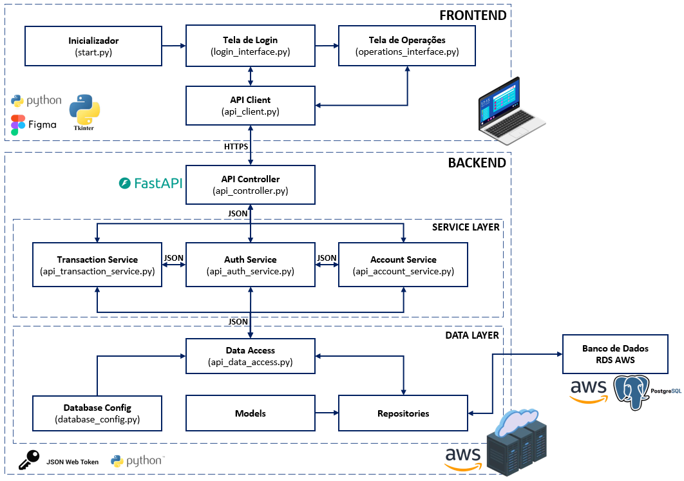
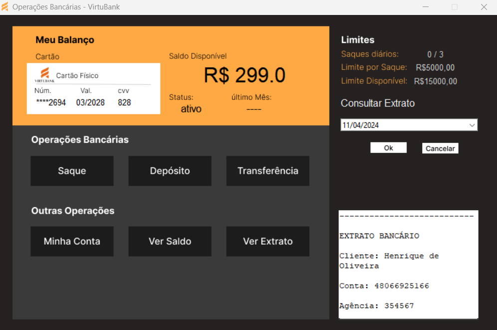
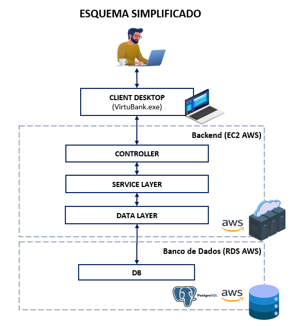

# SISTEMA DE TRANSAÇÕES E GESTÃO DE DADOS EM NUVEM: Um Projeto de Aprendizado de Desenvolvimento de Software

## DESCRIÇÃO
O projeto VirtuBank é uma aplicação desktop desenvolvida com o intuito de simular operações bancárias básicas, como depósitos, saques, transferências, além de consulta de saldos e extratos. Este sistema foi criado como parte do meu processo de aprendizado pessoal em desenvolvimento de software, servindo como uma oportunidade prática para aplicar e demonstrar as habilidades e conhecimentos que venho adquirindo na área.

As funcionalidades do sistema incluem:
- Realização de saques;
- Efetuação de depósitos;
- Execução de transferências entre contas;
- Consulta de saldos e informações detalhadas da conta;
- Acesso a extratos das transações efetuadas.

Este projeto abrange uma combinação de conhecimentos técnicos no desenvolvimento backend de software, tais como:
1. **Linguagem de Programação**:
- Python.
  
2. **Banco de Dados e Gerenciamento de Dados**:
- Modelagem: Construção de modelos conceituais e lógicos para o desenvolvimento de bancos de dados relacionais.
  
- SQL: Conhecimento em implementação e gerenciamento de bancos de dados relacionais usando PostgreSQL.
  
- ORMs: Uso de mapeamento objeto-relacional com o SQLAlchemy.
  
3. **Arquitetura de Sistemas**:
- Desenvolvimento de APIs com FastAPI.
  
- Conhecimento de padrões de projeto e arquitetura para facilitar a escalabilidade e manutenção do sistema.
  
- Autenticação e segurança: implementação de autenticação, autorização e segurança em APIs com uso de tokens JWT.
  
4. **Compreensão de Performance e Otimização**:
- Análise de performance para otimizar o desempenho da aplicação: identificação de gargalos e implementação de melhorias para otimizar a perfomance do sistema.

5. **Serviços de Nuvem**:
- EC2 AWS: Criação e gerenciamento de instâncias de servidor virtual para hospedar a aplicação.
- RDS AWS: Criação e gerenciamento de instâncias de banco de dados relacional.

## INÍCIO RÁPIDO
Este guia fornece instruções rápidas para começar a usar o sistema.
### Instalação para Desenvolvimento
Siga os passos abaixo para configurar o ambiente e iniciar o projeto:
#### Pré-requisitos
Antes de iniciar, certifique-se de ter os seguintes softwares instalados em seu sistema:
- Python (versão 3.10 ou superior)
- Visual Studio Code (ou outra IDE de preferência)
- Postman
- Git
- PostgreSQL (versão 12 ou superior)
1. **Clonar o repositório**\
Use o Git para clonar o repositório do projeto para o seu ambiente local. Abra um terminal e digite o seguinte comando:
<body>
  <pre>
    https://github.com/marioshenrique/simple_banking_transaction_system.git
  </pre>
</body>
</html>

2. **Configurar o ambiente virtual**\
Navegue até a pasta do projeto clonado e crie um ambiente virtual Python para isolar as dependências do projeto. Execute dentro do terminal:
<body>
  <pre>
    python -m venv venv\
  </pre>
</body>
</html>

3. **Ativar o ambiente virtual com o comando**\
Ative o ambiente virtual com o seguinte comando:
<body>
  <pre>
    .venv\Scripts\activate
  </pre>
</body>
</html>

4. **Instalar dependências**\
Instale todas as dependências necessárias para o projeto usando o arquivo 'requirements.txt' fornecido dentro da pasta do projeto. Com o ambiente virtual ativado, execute o seguinte comando:\
<body>
  <pre>
    pip install -r requirements.txt
  </pre>
</body>
</html>

5. **Configurar variáveis de ambiente**\
Copie o arquivo '.env.example' contido no diretório 'api' para um novo arquivo chamado '.env' e preencha-o com suas configurações locais.\
O arquivo '.env' deverá conter a seguinte estrutura:

<body>
  <pre>
    SECRET_KEY = 'SECRETKEY_JWT'
    ALGORITHM = 'ALGORITHM_JWT'
    DATABASE_URL = "postgresql://"[usuário]:[senha]@[host]/[base de dados]"
    DATABASE_URL_ASYNC = "postgresql+asyncpg://[usuário]:[senha]@[host]/[base de dados]"
  </pre>
</body>
</html>

6. **Reconstruir o banco de dados do PostgreSQL na máquina local**\
Para reconstruir a estrutura do banco de dados na sua máquina local, siga os passos abaixo:
- Crie uma instância vazia do banco de dados executando o seguinte comando no seu terminal:
<body>
  <pre>
    psql -U username -h hostname -d postgres -c "CREATE DATABASE database_sistema;"
  </pre>
</body>
</html>

- Importe o arquivo de estrutura SQL contido em 'database/init/' para o novo banco de dados usando o 'psql':
<body>
  <pre>
    psql -U username -h hostname -d database_sistema -f database_structure.sql
  </pre>
</body>
</html>

- Após isso, verifique se todas as tabelas foram criadas corretamente e verifique também as definições das tabelas.

7. **Gerar e Inserir dados no Banco de Dados**\
Para gerar dados e inseri-los no banco de dados criado localmente em sua máquina, siga os passos abaixo:
- Na pasta 'database/seed' configure a URI de conexão com o banco de dados, que deverá estar no seguinte formato:
<body>
  <pre>
    uri = "postgresql://'[usuário]:[senha]@[host]/[base de dados]'"
  </pre>
</body>
</html>
  
- Na pasta 'database/seed/' execute o script 'generate_data.py'. Esse script ira gerar os dados fakes para as tabelas 'CLIENTE', CONTA_BANCARIA', AGENCIA e CARTOES_CLIENTE. Com esses dados você poderá logar e realizar testes no sistema para verificar a funcionalidade da aplicação.
 
- Após a execução do script 'generate_data.py' visualize as tabelas e verifique se os dados foram inseridos corretamente antes de executar a aplicação.
    
8. **Executar o projeto**\
Após a instalação das dependências e configurações das variáveis de ambiente, o sistema está pronto para ser executado em um servidor local. Para isso, execute o seguinte comando no terminal:
<body>
  <pre>
    uvicorn api.api_controller:app --reload
  </pre>
</body>
</html>

9. **Configurar a URL base da API**\
Configure a URL BASE da API no scprit 'api_client.py' na pasta 'app/' com a URL fornecida pelo uvicorn como endpoint base para conectar o frontend com o backend.

10. **Executar a aplicação**\
Em seguida, execute o script 'start.py' contido na pasta 'app/' para inicializar o sistema.

As credenciais de login que deverão ser fornecidas são as credenciais das contas que estão armazenadas no banco de dados local, caso o sistema esteja usando o banco de dados local.

### Instalação para Testes do Sistema em Produção
Siga os passos baixo para acessar o sistema em produção:

1. Inicialize a aplicação a partir do executável 'VirtuBank.exe'
2. Insira as informações de 'número da agência', 'número da conta corrente' e 'senha', fornecidos na seção a seguir, para acessar o sistema em produção.

Caso o firewall do seu sistema impeça o download da aplicação desktop, você poderá reconstruir o executável na sua máquina. Para isso, siga os passos fornecidos na seção "Instalação para Desenvolvimento" e, em seguida, insira o seguinte comando no terminal do diretório principal da aplicação:
<body>
  <pre>
    'pyinstaller --noconfirm --onefile --windowed --icon "app/VirtuBanck_icone-removebg-preview.ico" --debug "all" --hidden-import=babel.numbers  --add-data "app/tela_login_usuario;tela_login_usuario/" --add
    data "app/tela_operacoes;tela_operacoes/" --add-data "app/api_client.py;." --add-data "app/login_interface.py;." --add-data "app/operations_interface.py;." --add-data "app/start.py;." --add-data
    "app/VirtuBanck_icone-removebg-preview.ico;."  "app/start.py"'
  </pre>
</body>
</html>

Após a execução deste comando, duas novas pastas serão criadas no seu diretório principal: 'build' e 'dist'. O executável poderá ser encontrado na pasta 'dist'.

As informações de login necessárias para testar a aplicação são fornecidas na seção 'Uso'.

## USO

As credenciais de acesso abaixo referem-se a contas cadastradas no banco de dados em produção. Essas credenciais são necessárias para acessar o sistema a partir da tela de login. Para ter acesso, basta selecionar uma das credenciais fornecidas abaixo:

| Número da Agência | Número da Conta | Senha |
|-------------|-------------|-------------|
| 739567 | 10428246323 | senha1234 |
| 962957 | 29095636477 | senha1234 |
| 128563 | 58122730766 | senha1234 |
| 739567 | 35344959773 | senha1234 |
| 128563 | 60424333326 | senha1234 |
| 128563 | 97213348767 | senha1234 |
| 739567 | 07006585712 | senha1234 |
| 128563 | 98269132845 | senha1234 |

## TECNOLOGIAS UTILIZADAS
Abaixo destaco as principais ferramentos que foram utilizadas para o desenvolvimento deste projeto.

- **[FastAPI](https://fastapi.tiangolo.com/)**: Framework web para construção de APIs, escolhido devido à sua alta performance.
  
- **[SQLAlchemy](https://www.sqlalchemy.org/)**: Biblioteca SQL toolkit e Object-Relational Mapping (ORM) que permite trabalhar com bancos de dados de forma segura, auxiliando na construção de um código mais limpo e organizado.

- **[JWT (JSON Web Tokens)](https://jwt.io/)**: Foi implementada a autenticação e autorização no sistema por meio de JWT. Permitindo a criação de tokens de acesso e atualização para segurança do sistema e gerenciamento de sessões de usuários.

- **[PyJWT](https://pypi.org/project/PyJWT/)**: Biblioteca pra codificar e decodificar tokens JWT. Essencial para autenticação e autorização no projeto.

- **[Uvicorn](https://www.uvicorn.org/)**: Servidor ASGI utilizado para execução da aplicação FastAPI.

- **[Pydantic](https://docs.pydantic.dev/latest/)**: Utilizado para validação de dados. O Pydantic foi empregado na construção da API para definição de esquemas de dados.

- **[python-dotenv](https://pypi.org/project/python-dotenv/)**: Responsável por carregar as variáveis de ambiente a partir do arquivo '.env'.

- **[tkinter](https://docs.python.org/pt-br/3/library/tkinter.html)**: Biblioteca utilizada na criação das interfaces de usuário (UI).

- **[PostgreSQL](https://www.postgresql.org/)**: Gerenciador de bancos de dados relacionais (SGBD).

- **[EC2 AWS (Amazon Elastic Compute Cloud)](https://aws.amazon.com/pt/ec2/)**: Serviço de computação em nuvem da Amazon Web Services que permite a computação em nuvem. Foi utilizado neste projeto para hospedar a aplicação.

- **[RDS AWS (Amazon Relational Database Service)](https://aws.amazon.com/pt/rds/)**: Serviço de banco de dados relacional gerenciado da Amazon Web Services. O RDS foi utilizado para hospedar o banco de dados PostgreSQL na nuvem.

## ESTRUTURA DO PROJETO
O sistema é um aplicação de transações que segue uma arquitetura dividida em camadas, separando responsabilidades entre frontend e backend, e dentro do backend entre API Controller, Service Layer e Data Layer. Abaixo está detalhada a estrutura e a função de cada camada no sistema:

A estrutura geral do sistema é apresentada na figura a seguir.

### Frontend
- **start.py**: Script de inicialização da aplicação no lado do cliente.
  
- **login_interface.py**: Interface gráfica para a tela de login. É Responsável por exibir a interface de login conforme mostrado na figura abaixo.

  
- **operations_interface.py**: Interface gráfica para a realização de operações de transação, consultas, etc. Responsável por exibir a interface gráfica onde os usuários podem efetuar suas operações no sistema.

  
- **api_client.py**: Responsável pela comunicação com o backend, enviando requisições HTTP à API e processando as respostas para as interfaces de usuário.

### Backend
#### Controller
- **api_controller.py**: Atua como um intermediário entre o frontend e o Service Layer, recebendo requisições HTTP do 'api_client.py', encaminhando-as para os services apropriados, e retornando as respostas processadas para o frontend via HTTP.

#### Service Layer
Camada que contém a lógica de negócios do sistema, processando os dados recebidos do Controller e interagindo com o Data Layer para acessar ou modificar os dados no banco de dados.
- **Transaction Service**: serviço responsável por gerenciar as transações realizadas no sistema pelo usuário a partir da tela de operações.
  
- **Auth Service**: Responsável por operações de autenticação e autorização.

- **Account Service**: Responsável por gerenciar informações e operações de consulta relacionadas às contas dos usuários.

#### Data Layer
Essa camada é responsável pela interação do sistema com o banco de dados PostgreSQL, que é hospedado no serviço RDS da AWS. Essa camada abstrai a lógica de acesso ao banco de dados, permitindo que a camada de serviço (Service Layer) solicite a execução de operações de dados sem se preocupar com os detalhes de implementação do banco de dados. As responsabilidades e componentes dessa camada incluem:
- **api_data_access.py**: Eset script atua como um intermediário, expondo funções que são usadas pela Service Layer para solicitar operações de dados. Esse script não interage diretamente com o banco de dados, mas serve como um intermediário, invocando a lógica contida nos scripts do diretório 'repositories/', responsáveis por interagir diretamente com o banco de dados.

- **database_config.py**: Armazena as configurações necessárias para conectar o backend ao banco de dados, incluindo credenciais, endereço do servidor, parâmetros de conexão, etc.

- **models/**: Diretório que contém os modelos das tabelas do banco de dados, representando a estrutura de dados que o sistema utiliza. Cada modelo define a estrutura de uma tabela específica, incluindo os campos, tipos de dados, restrições, etc.

- **repositories/**: Diretório que contém os scripts que implementam a lógica de interação direta com o banco de dados. Estes repositórios abstraem as consultas SQL e as operações de banco de dados, transformando os resultados em objetos python que podem ser manipulados pelo resto do sistema. Após processar umam solicitação, os repositórios devolvem a resposta para 'api_data_access.py' que, por sua vez, encaminha para a Service Layer.

Através dessa estrutura, a Data Layer facilita uma separação entre a lógica de negócios e as operações de banco de dados.

Em resumo, o sistema apresenta a seguine estrutura:

### Modelagem do Banco de Dados
#### Esquema do Banco de Dados
O banco de dados utilizado no projeto foi projetado para suportar operações de transações, gerenciamento de contas de usuário e autenticação no sistema. A modelagem foi feita utilizando boas práticas de design de banco de dados relacional para segurar a integridade, segurança e escalabilidade dos dados do sistema.
##### Modelo Conceitual
O modelo conceitual abaixo fornece uma visão da estrutura do banco de dados, destacando as entidades, seus atributos e as relações entre elas. A partir deste modelo ém possível entender como as informações são organizadas e como elas interagem dentro do sistema.

#### Modelo Lógico
O modelo lógico mostrado abaixo é uma extensão do modelo conceitual, oferecendo mais detalhes sobre a estrutura do banco de dados, incluindo tipos de dados, restrições e detalhes sobre as relações entre as tabelas. Esse modelo foi utilizado como base para a implementação física do banco de dados.

## AUTORES E RECONHECIMENTOS
### Autor
Este projeto foi desenvolvido por [Mario Henrique](https://github.com/marioshenrique), como parte de um esforço pessoal para aplicar conhecimentos adquiridos em desenvolvimento de software, com foco em práticas de engenharia de software, modelagem de dados e segurança de aplicações.

### Contribuidores
Gostaria de agradecer a todos que ofereceram suporte técnico e feedback durante o desenvolvimento deste projeto de portfólio pessoal.
- **[Ewerton Oliveira](https://github.com/ewerton94/)**: Por fornecer suporte profissional, contribuindo com sugestões de arquitetura de software e boas práticas de desenvolvimento de aplicações.
- **[Carlos Filho](https://github.com/CarlosFFilho)**: Pela troca de experiências e ideias ao longo do projeto.

